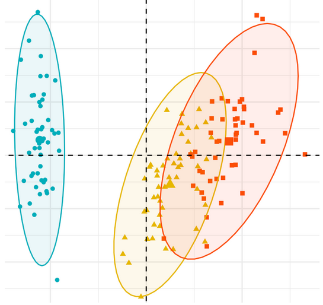

# Construire l'espace social de la pauvreté avec un Baromètre d'opinion

Ce mémoire de recherche a été réalisé dans le cadre de mon double diplôme de troisième année à l’École nationale de la statistique et de l'administration économique (**ENSAE**) et de **Master 2 de Sociologie**, parcours Sociologie Quantitative & Démographie (SQD) accrédité Université Paris-Saclay.

### Résumé

En mobilisant le Baromètre d’opinion de la Drees, nous avons construit un espace social de la pauvreté mobilisant trois dimensions largement citées dans la littérature : monétaire, institutionnelle et subjective.

En compléments des méthodes d’analyse factorielle et d’économétrie classiques, nous avons mobilisé des méthodes en variables latentes : analyses en facteurs communs exploratoires et confirmatoires, assez peu utilisées dans les travaux français. 

Ces méthodes ont pu montrer que les dimensions de la pauvreté sont non seulement théoriquement construites mais également empiriquement validées. L’étude de leurs interactions permet de décrire avec plus de précisions la nature et l’étendue des phénomènes de pauvreté en France ainsi les groupes sociaux concernés par une ou plusieurs formes de pauvreté. 

### Liens utiles

- **Rapport de stage** aux formats [web](https://antuki.github.io/EspaceSocial_Pauvrete/rapport/_book/index.html) et [PDF](https://antuki.github.io/EspaceSocial_Pauvrete/rapport/_book/M2_ANTUNEZ_SQD.pdf)

- **Travaux statistiques associés** 
  
  *	*Fiche 1* : [Lasso exploratoire](https://antuki.github.io/EspaceSocial_Pauvrete/modeles/modeles1.pdf) 
  
  *	*Fiche 2* : [Statistique bi-variée](https://antuki.github.io/EspaceSocial_Pauvrete/modeles/modeles2.pdf) 
  
  *	*Fiche 3* [Réplication et reproduction de Duvoux, Papuchon 2018](https://antuki.github.io/EspaceSocial_Pauvrete/modeles/modeles3.pdf)
  
  *	*Fiche 4* : [Modélisations économétriques des déterminants du sentiment de pauvreté](https://antuki.github.io/EspaceSocial_Pauvrete/modeles/modeles4.pdf)
  
  
  *	*Fiche 5* : [Constuction de l'espace social de la pauvreté par Analyse des Correspondances Multiples](https://antuki.github.io/EspaceSocial_Pauvrete/modeles/modeles5.html)
  
  *	*Fiche 6* : [Constuction de l'espace social de la pauvreté par Analyses en Facteurs communs Exploratoire et Confirmatoire](https://antuki.github.io/EspaceSocial_Pauvrete/modeles/modeles6.pdf)
  
   *	*Annexe* : [Prolongements du mémoire en vu d'un article de recherche](https://antuki.github.io/EspaceSocial_Pauvrete/modeles/prolongements_article.pdf) 
  
  
### Reproductibilité

Pour pouvoir reproduire les travaux de ce mémoire, il vous faudra télécharger les [données 2019 du Baromètre d'opinion de la Drees](https://drees2-sgsocialgouv.opendatasoft.com/explore/dataset/431_le-barometre-d-opinion/information/). Puis, il faudra créer à la racine de ce projet un dossier appelé *data/2019*. Les bases de données intermédiaires sont créées grâce aux codes contenus dans le dossier [preprocessing](preprocessing). 

Le langage informatique utilisé dans ce projet est R. 

### Crédits et Licence

Les contenus de ce répertoire sont diffusés sous licence [CC BY-NC-SA 3.0](https://creativecommons.org/licenses/by-nc-sa/3.0/). Vous êtes libre d'utiliser ces contenus et de les modifier à la seule condition d'en accréditer la provenance et de les rediffuser selon les mêmes termes en indiquant notamment © 2021 mémoire de recherche en sociologie quantitative de Kim Antunez.

