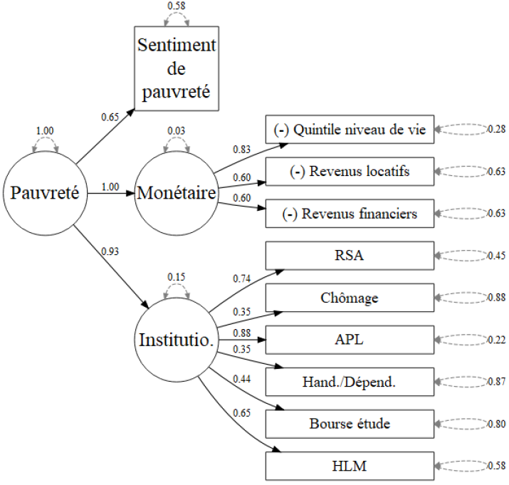

# Au-delà du revenu : la place de la dimension subjective dans la structure de la pauvreté en France

*Auteurs : Kim Antunez, Ivaylo Petev*

Ce lien github rassemble les codes ayant permis la production des modélisations et figures de l'article. 

**Liens utiles**

   *	[Figures de l'article](https://antuki.github.io/EspaceSocial_Pauvrete/rfs/figures_rfs.pdf) 
   *    [Manuel technique : Analyses factorielles et Analyses en facteurs communs](https://antuki.github.io/EspaceSocial_Pauvrete/rfs/manuel_technique.pdf)

_Note : la [branche RFS](https://github.com/antuki/EspaceSocial_Pauvrete/tree/RFS) de ce répertoire se limite aux travaux présents dans l'article de recherche. La [branche *main*](https://github.com/antuki/EspaceSocial_Pauvrete) contient également les travaux initiaux émanent d'un mémoire de recherche._

## Reproductibilité

Pour pouvoir reproduire les travaux de ce papier, il vous faudra télécharger les [données 2019 du Baromètre d'opinion de la Drees](https://drees2-sgsocialgouv.opendatasoft.com/explore/dataset/431_le-barometre-d-opinion/information/). Puis, il faudra créer à la racine de ce projet un dossier appelé *data/2019*. Les bases de données intermédiaires sont créées grâce aux codes contenus dans le dossier [preprocessing](preprocessing). 

Le langage informatique utilisé dans ce projet est R. 

## Crédits et Licence

Les contenus de ce répertoire sont diffusés sous licence [CC BY-NC-SA 3.0](https://creativecommons.org/licenses/by-nc-sa/3.0/). Vous êtes libre d'utiliser ces contenus et de les modifier à la seule condition d'en accréditer la provenance et de les rediffuser selon les mêmes termes en indiquant notamment © 2021 mémoire de recherche en sociologie quantitative de Kim Antunez.

## Mémoire de recherche

Cet article est le prolongement de mon mémoire de recherche. Ce mémoire a été réalisé dans le cadre de mon double diplôme de troisième année à l’École nationale de la statistique et de l'administration économique (**ENSAE**) et de **Master 2 de Sociologie**, parcours Sociologie Quantitative & Démographie (SQD) accrédité Université Paris-Saclay.

**Liens utiles**

- **Mémoire de recherche** aux formats [web](https://antuki.github.io/EspaceSocial_Pauvrete/rapport/_book/index.html) et [PDF](https://antuki.github.io/EspaceSocial_Pauvrete/rapport/_book/M2_ANTUNEZ_SQD.pdf)

- **Travaux statistiques associés annexes** 
  
  *	*Fiche 1* : [Lasso exploratoire](https://antuki.github.io/EspaceSocial_Pauvrete/modeles/modeles1.pdf) 
  
  *	*Fiche 2* : [Statistique bi-variée](https://antuki.github.io/EspaceSocial_Pauvrete/modeles/modeles2.pdf) 
  
  *	*Fiche 3* [Réplication et reproduction de Duvoux, Papuchon 2018](https://antuki.github.io/EspaceSocial_Pauvrete/modeles/modeles3.pdf)
  
  *	*Fiche 4* : [Modélisations économétriques des déterminants du sentiment de pauvreté](https://antuki.github.io/EspaceSocial_Pauvrete/modeles/modeles4.pdf) 
  
  *	*Fiche 5* : [Constuction de l'espace social de la pauvreté par Analyse des Correspondances Multiples](https://antuki.github.io/EspaceSocial_Pauvrete/modeles/modeles5.html)
  
  *	*Fiche 6* : [Constuction de l'espace social de la pauvreté par Analyses en Facteurs communs Exploratoire et Confirmatoire](https://antuki.github.io/EspaceSocial_Pauvrete/modeles/modeles6.pdf)
    
  

