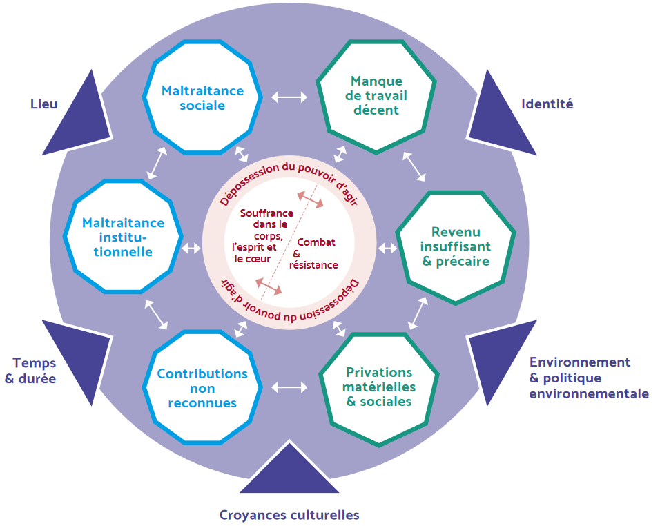

# Dimensions de la pauvreté : perspectives théoriques {#chap1}

S’il est désormais largement reconnu que la pauvreté est multidimensionnelle, l’identification de ses différentes dimensions et de la manière dont elles interagissent ne fait pas consensus. Dans cette revue de littérature^[Cette revue de littérature a été guidée et facilitée par l'excellent article de blog de  @auzuret2020signifie], nous présenterons tout d’abord les différentes théories et mesures de la pauvreté (partie \@ref(sec:multidim)). Puis, dans la partie \@ref(sec:pauvsubj), nous décrirons plus précisément l’approche subjective de la pauvreté, développée en particulier dans le cas de la France dans @duvoux2018qui. Enfin, ces différents éléments nous amèneront à exposer la démarche de ce mémoire en partie \@ref(sec:objmem), c'est-à-dire l'étude de l'interaction entre les dimensions de la pauvreté présentes dans le Baromètre d'opinion de la Drees, base de données que nous mobilisons. 

## La multidimensionnalité de la pauvreté soulignée dans la littérature {#sec:multidim}

### Pauvreté monétaire {#sec:monetaire}

Puisque nous vivons dans des sociétés marchandes, dans lesquelles tout bien ou service est mesuré monétairement, la question de la pauvreté est directement liée à la notion de revenus. La pauvreté est donc en premier lieu monétaire et se mesure en général au niveau du ménage, si l’on valide l’hypothèse fondamentale de mise en commun des ressources. Le repérage des ménages pauvres résulte de la comparaison de leur niveau de vie -- leur revenu disponible rapporté au nombre d’unités de consommation^[Les unités de consommation sont généralement calculées selon l’échelle d’équivalence dite de l’OCDE modifiée qui attribue 1 UC au premier adulte du ménage, 0,5 UC aux autres personnes de 14 ans ou plus et 0,3 UC aux enfants de moins de 14 ans.] (UC) du ménage -- avec un seuil de pauvreté. Ce dernier est, en France et en Union Européenne en général, déterminé de manière relative (en général 50 ou 60 % du revenu médian par UC des ménages). En 2018, en France métropolitaine, le seuil de pauvreté s’établissait pour une personne seule à 1 063 euros par mois (@demaison2020france).

Une première critique adressée à l’indicateur du seuil de pauvreté est qu’une grande partie du revenu est utilisée pour des dépenses dites « pré-engagées ». C’est d’ailleurs ce que le mouvement des « Gilets Jaunes » a permis de mettre en exergue en France durant l’hiver 2018 : même avec un emploi et des revenus relativement stables, un certain nombre de ménages ne parvenaient pas à boucler leurs fins de mois en raison de ces dépenses incompressibles, le tout dans un contexte de précarité montante (emplois à temps partiel, stagnation des salaires, inflation, en particulier des loyers, etc.). Outre les « besoins primaires » (@rawls2020theory) liés à la santé et à l’autonomie (se nourrir, se loger…), doit-on prendre en considération d’autres éléments du mode de vie (voire tous) pour étudier le phénomène de la pauvreté ? C’est notamment ce que pense l’économiste et philosophe indien Amartya Sen. Dans @sen1985commodities, il met l’accent sur la notion de « capacité », c’est-à-dire la liberté que doit avoir un individu de choisir entre différentes vies possibles, des souhaits qui varient selon les individus, et à un niveau plus large, selon les sociétés.  Une étude de la Drees (@lelievre2018inegalites) propose une mesure du seuil de pauvreté en déduisant des revenus les dépenses pré-engagées, et montre que les inégalités de niveau de vie sont encore plus marquées une fois que ces dépenses sont prises en compte.  

Par ailleurs, la mesure relative de la pauvreté monétaire ne permet pas d’appréhender les différences de situations qui peuvent correspondre à un même niveau de vie et rend également difficile les comparaisons internationales. C’est pourquoi certaines méthodologies sont proposées afin d’étudier la pauvreté monétaire absolue – également appelée privation matérielle – qui correspond à un niveau de vie inférieur à la valeur d’un « panier » de biens et services dont la disposition est jugée nécessaire pour satisfaire certains besoins considérés comme essentiels. Dans l’Union européenne, une personne est réputée en situation de privation matérielle et sociale si elle déclare ne pas avoir les ressources financières suffisantes pour couvrir les dépenses liées à au moins cinq éléments de la vie courante sur treize considérés comme très souhaitables pour avoir un niveau de vie acceptable^[Le dispositif européen EU‑SILC sur les revenus et les conditions de vie (Eurostat) permet d’apprécier les différences et les points communs entre pauvreté monétaire et privation matérielle et sociale.].

Dans la même logique, l’Observatoire national de la pauvreté (Onpes) a publié des budgets de référence établis grâce à une concertation mêlant citoyens et experts. Pour chaque type de ménage (actif isolé, retraité isolé, couple d’actifs sans enfants, etc.), une liste précise de biens et de services jugés nécessaires pour participer effectivement à la vie sociale a été établie. Le montant des budgets minima de référence sont situés entre 1 424 euros et 3 284 euros, selon le type de ménage (@onpes).

### Pauvreté institutionnelle {#sec:institutionnelle}

Outre la conception monétaire de la pauvreté, l’approche institutionnelle compte le nombre de ménages pauvres à partir de ceux bénéficiant des minima sociaux, c’est-à-dire d’un revenu minimum garanti basé sur des critères établis par l’État. En 2018, 11 % de la population française était couverte par les minima sociaux, si l’on compte les conjoints et enfants à charge des bénéficiaires (@calvo20192018).

Cette approche est inspirée de Georg Simmel et s’est développée dans un contexte du développement du chômage de masse à la suite duquel la pauvreté est devenue un objet d’intervention publique. La pauvreté institutionnelle renseigne alors sur la relation d’assistance qui lie l’individu à la société (@simmel2011pauvres). Selon Simmel, c’est la société qui définit en partie la pauvreté par les normes auxquelles elle se réfère pour venir en aide aux populations. Cette relation d’assistance définit la pauvreté comme une identité (@paugam1991disqualification), plus encore qu’un état d’une personne manquant de biens matériels. Elle correspond à un statut social spécifique et dévalorisé, comme l’illustre très bien l’expression « cas sociaux » faisant référence à la fois à une situation entraînant des risques d’exclusion sociale nécessitant une prise en charge par la société mais aussi à un groupe social d’individus étant dans cette condition. 

Or, cette relation d’assistance qui se noue avec l’État diffère fortement selon les cultures et les pays. Dans @esping1990three, l’auteur décrit les processus d’émergence des trois types de régimes sociaux en Europe. Cette typologie a contribué à la considération de la protection sociale comme une dimension déterminante dans la compréhension des structures sociales des sociétés contemporaines, en lien notamment avec les politiques de luttes contre les inégalités sociales et la pauvreté.  Tout d’abord, le modèle social-démocrate, le plus universaliste, accorde les mêmes droits à l’ensemble des citoyens. Le modèle libéral se fonde sur une sécurité plus minimale destinée aux personnes les plus dans le besoin. Enfin, le modèle bismarckien, auquel la France est souvent rattachée tout comme l’Allemagne, vise à maintenir un revenu en dépit des risques sociaux grâce à une assurance sociale obligatoire. Le Baromètre d’opinion de la Drees permet de voir qu’en dépit de la dominante bismarckienne du système de sécurité sociale français, les Français sont particulièrement attachés à l’universalité de certaines prestations sociales (@grislain2017diminution).

L’étude de la pauvreté ne peut donc pas se faire sans analyser en parallèle le rôle des pouvoirs publics dans la lutte contre la pauvreté. Ils peuvent en effet impulser des mesures pour augmenter les ressources des ménages (prestations sociales, baisses d’impôts...) comme en France lors de la récente « Loi portant mesures d’urgence économiques et sociales » adoptée fin décembre 2018 à la suite du mouvement des « Gilets Jaunes » qui a amené notamment à revaloriser la prime d’activité. Plus anciennement, le « plan pluriannuel contre la pauvreté et pour l’inclusion sociale » de 2013 visait, en plus de réduire les inégalités, à davantage accompagner les citoyens vers l’insertion. Enfin, les pouvoirs publics insistent également beaucoup sur des politiques de reprise de l’emploi (comme le développement de l’apprentissage^[Dans @cahuc2014apprentissage, les auteurs montrent que, contrairement à d’autres pays, l’expansion des effectifs d’apprentis a essentiellement bénéficié aux jeunes déjà diplômés en France. Les auteurs l’expliquent par la complexité du circuit de formation professionnelle en alternance français, par la perception trop peu positive de cette orientation par le corps enseignant ou encore par la non-adéquation des formations d’apprentissage avec les besoins des entreprises.]) comme moyen de faire baisser le niveau de pauvreté. Toutefois, l’existence d’emplois de plus en plus précaires invitent à complexifier l’analyse purement monétaire de la pauvreté décrite en partie \@ref(sec:monetaire). 

### Le halo de la pauvreté

Les différentes dimensions et mesures de la pauvreté font souvent l’objet d’analyses sociologiques indépendantes, bien qu’elles interagissant en réalité les unes avec les autres. Le brouillage des frontières entre les différentes causes potentielles de la pauvreté est appelé « halo de la pauvreté ». Ces causes sont appelées ici « facteurs de précarité », faisant référence, comme dans @cingolani2005precarite à des facteurs de risques étant susceptibles de faire basculer certaines populations plus que d'autres dans la pauvreté : temps partiels, CDD, travail intérimaire, chômage, accidents de la vie divers... 

Certaines franges de la population ont ainsi une position sociale durablement jugée inférieure sur une échelle de prestige ainsi que des difficultés à se projeter dans l’avenir : cela peut être dû à leur situation familiale (monoparentalité, famille nombreuse...) ou encore aux déséquilibres du marché de l’emploi évoqué ci-dessus qui amènent à l’existence de « travailleurs pauvres » (@ponthieux2004travailleurs). Par ailleurs, un même niveau de pauvreté n’a pas la même signification selon s’il correspond à une situation durable (ancrage dans la pauvreté) ou plus ponctuelle. C’est pourquoi il est également important d’étudier des indicateurs de dynamiques de pauvreté en plus des indicateurs d’état. Cela peut être rendu possible grâce à des analyses longitudinales de la pauvreté comme celle de @lollivier2005trois, mais celles-ci demeurent rares car les données quantitatives qui le permettent sont elles-mêmes rares.

## L'apport de la dimension subjective dans l'étude de la pauvreté {#sec:pauvsubj}

### Pauvreté subjective 

L’approche subjective de la pauvreté s’appuie sur la manière dont les individus perçoivent leur situation. Il existe deux approches principales dans la littérature française et internationale.

La première s’intéresse aux difficultés financières perçues en mettant notamment en relation le niveau de vie minimum nécessaire -- tel qu’il ressort d’enquêtes auprès d’individus -- au niveau de vie dont ils disposent effectivement. Cette approche permet d’élaborer des seuils de pauvreté subjective (*subjective poverty lines*, @veit1987consensual) et d’effectuer des comparaisons internationales sur le sujet (@paugam2002experience ; @paugam2005perception) mais ne permet probablement pas réellement aux individus de s’affranchir des normes sociales quand ils formulent leurs réponses (@spicker2007poverty, p. 199).

La seconde s’intéresse à des indicateurs de privation (*deprivation indicator approach*, @mack1985poor) telle que la mesure de la pauvreté monétaire absolue présentée plus haut qui s’intéresse à l’accès à un panier de biens et services jugés essentiels par la population. 

Ces deux approches subjectives se fondent toutefois principalement sur une approche monétaire de la pauvreté qui est donc qualifiable « d’indirecte ». C’est la raison pour laquelle d’autres mesures s’intéressent également à des mesures plus « directes » de la pauvreté subjective en demandant, aux individus de s’auto-classer au niveau de la hiérarchie sociale. Toutefois, utiliser ce résultat comme mesure subjective de la pauvreté suppose que les notions de pauvreté et d’intégration sociale sont assimilables, et met de côté le lien avec l’insécurité sociale. 


### L'approche de Duvoux et Papuchon {#sec:approcheduvoux}

Les travaux de @duvoux2018qui confrontent les mesures monétaires et institutionnelles de la pauvreté à plusieurs mesures subjectives collectées dans le Baromètre d’opinion de la Drees. De cette manière, la pauvreté est définie de manière inductive par son aspect subjectif sans pour autant mettre de côté l’objectivation permise par les indicateurs classiques de statistique publique.

La principale mesure correspond au sentiment de pauvreté, une indicatrice des individus qui déclarent se sentir pauvre (voir la question `PE3` en annexe \@ref(annexequestio)). En 2019, c’était le cas de 19 % des Français^[L’ensemble de ces chiffres, et de ceux qui suivent dans le reste du mémoire, ne concernent que les individus ayant souhaité s’exprimer (chiffres sans les « ne se prononcent pas »).]. Leur étude mobilise également, dans une moindre mesure, deux autres approches de la pauvreté subjective : une qui s’intéresse au besoin d’aide publique et une autre sur les difficultés financières perçues qui mesure l’écart entre le revenu du ménage du répondant (qu’il déclare) et celui dont un foyer comme le sien doit (selon lui) disposer au minimum pour vivre. 

Ces différentes mesures de pauvreté subjective leur permettent de montrer que les mesures traditionnelles (monétaire et institutionnelle) de la pauvreté sont trop réductrices. En particulier, l’approche relationnelle d’assistance de Simmel rétrécit selon les auteurs le périmètre de la pauvreté puisque certains publics ne sont pas pris en charge par les aides sociales et que, par ailleurs, le non-recours aux prestations sociales est un sujet particulièrement présent en France. Ils cherchent donc à valider empiriquement le recours au sentiment de pauvreté en complément des indicateurs traditionnels.

En mettant en lumière le non-recoupement des définitions, ils cherchent à toucher du doigt le halo de la pauvreté évoqué plus haut. Certaines populations, bien que non pauvres monétairement, s’estiment pauvres. C’est notamment le cas de respectivement 2 % et 7 % des personnes appartenant à des ménages du quatrième et dernier quintile de niveau de vie en 2019 (figure \@ref(fig:figintro)). À l’inverse, certaines personnes, bien qu’objectivement pauvres, ne se déclarent pas comme telles (plus de la moitié des personnes appartenant au premier quintile de niveau de vie). Ils apportent une illustration à la thèse selon laquelle le sentiment de pauvreté ne concerne pas que les personnes en situation d’assistance ou éloignées du marché du travail mais concerne également une partie des personnes en emploi, notamment les ouvriers et les employés. 

Enfin, ils insistent sur l’appréciation négative portée par les personnes qui se déclarent pauvres sur leur trajectoire passée et leur avenir et en concluent que « la pauvreté subjective se comprend sociologiquement comme un indicateur d’insécurité sociale durable ». Ce point précis a fait l’objet de quelques controverses sociologiques exposées dans la partie \@ref(sec:limitesduvoux) qui suit. 


### Les limites identifiées d'une telle approche {#sec:limitesduvoux}

Cet article a été l’origine de deux discussions (@paugam2020se et @lahieyte2020sociologie) permettant de revenir sur l’approche proposée par les précédents auteurs.

Les débats portent tout d’abord sur les éventuels biais dans la mesure du sentiment de pauvreté. Comme dans toute enquête, d’autant plus s’agissant d’une enquête d’opinion, les réponses sont liées à la formulation de la question. Or, la question utilisée semble imprécise selon plusieurs aspects, ce qui rend difficile l’identification de ce qui est réellement mesuré. On ne sait pas ce que les enquêtés entendent par « un foyer comme le leur » et font-ils bien dans leurs réponses référence au revenu de leur ménage ou bien uniquement au leur ? Les réponses dépendent également du rapport qui se tisse entre enquêteur et enquêté : il est fort probable que certaines personnes pourraient ne pas oser se déclarer pauvres. D’ailleurs, le fort pourcentage de non-réponse à cette question (6 % en 2019 contre un maximum de 1 ou 2 pourcents pour la plupart des questions de l’enquête) va dans le sens de cette interprétation. C’est pourquoi @duvoux2020insecurite recommandent dans leur réponse de s’intéresser davantage à l’interprétation des résultats en gardant en tête le fait que cet indicateur est un proxy permettant de mesurer tout un ensemble d’éléments complexes à appréhender, comme dans toute enquête d’opinion. 

D’après @paugam2020se, les auteurs opposent également trop souvent l’aspect subjectif (pauvreté déclarée) à l’aspect institutionnel (perception de minima sociaux) et devraient davantage faire le lien entre les deux. Selon Paugam, le sentiment d’être pauvre serait prioritairement mis en lien par les auteurs avec le climat d’insécurité sociale qui accompagne la crise salariale et pas assez avec la prise en charge institutionnelle de l’assistance montrée par Simmel. Pourtant, toujours selon Paugam, le développement de l’assistance est, depuis les années 1980, en France et dans les pays occidentaux, une conséquence directe de la précarisation des emplois et de la montée du chômage.

De manière générale, Duvoux et Papuchon partent de l’hypothèse que leur mesure du sentiment de pauvreté traduit avant tout une condition d’insécurité sociale, c’est-à-dire de déficit de garantie face à l’avenir. Or, ils n'insistent pas assez, selon Paugam, sur une autre interprétation qu'il juge plus importante : l’infériorité sociale, c’est-à-dire le manque de reconnaissance sociale et le sentiment d’inutilité sociale. Ces différents éléments d’explication peuvent d’ailleurs être en partie testées grâce aux données des modules thématiques de questions « opinion générale » et « pauvreté / exclusion » du Baromètre de la Drees. Concernant l’insécurité sociale, on interroge notamment les Français sur leur optimisme face à l’avenir (pour eux, mais aussi pour les générations futures) et sur leur vision sur l’évolution passée et à venir des inégalités d’une part et de la pauvreté et l’exclusion d’autre part. Pour l’infériorité sociale, l’appréciation des Français sur la manière (de très mauvaise à très bonne) dont ils considèrent leur situation actuelle ou sur leur sentiment ou non d’avoir une situation moins bonne que leurs parents au même âge (déclassement intergénérationnel) pourrait éclairer une partie du phénomène.

## Etudier les interactions entre les dimensions de la pauvreté {#sec:objmem}

### Objectif : modéliser l’espace social de la pauvreté

La pauvreté, en plus d’être multidimensionnelle et de reposer sur des dimensions qui ne se recoupent pas entièrement, dépend donc aussi de situations individuelles particulières et de facteurs potentiellement inobservables. Cela explique la difficulté méthodologique de définir ce phénomène. Quand bien même on arriverait à définir les indicateurs les plus pertinents, il faudrait ensuite définir un moyen de construire une échelle de la pauvreté. Or, dès lors que l’on sort du cadre de l'unidimensionnalité, on ne dispose pas d’une méthode exacte pour classer sans ambiguïté les individus dans des « catégories de pauvreté ». Et peut-on vraiment considérer la pauvreté comme étant ordinale quand on se base sur les théories de liberté de choix individuels et de pluralisme des goûts comme le fait @sen1985commodities ? 

Cette complexité du sujet même de pauvreté et les débats sur la détermination de ses dimensions a fait naître des initiatives internationales de recherche participative sur les dimensions de la pauvreté comme celle de l’association @atdquartmonde. Des personnes en situation de pauvreté, des professionnels et des universitaires de différents pays^[Au Bangladesh, en Bolivie, en France, en Tanzanie, au Royaume-Uni et aux États-Unis.] ont travaillé ensemble pour aboutir à trois groupes de dimensions de la pauvreté (figure \@ref(fig:figatd)) interdépendantes faisant la synthèse de ce qui a été évoqué précédemment. Le premier groupe, situé au centre de la figure \@ref(fig:figatd), forme le cœur de l’expérience de la pauvreté : les souffrances physiques ou mentales résultant de la dépossession du pouvoir d’agir (le manque de contrôle sur sa vie), causées par les privations auxquelles les personnes réagissent par de la lutte et de la résistance. Un deuxième groupe rassemble les dimensions relationnelles de la pauvreté : les maltraitances institutionnelles (incapacité des institutions à répondre aux besoins), sociales (par d’autres groupes sociaux) et les compétences non reconnues des personnes en situation de pauvreté. Le dernier groupe rassemble les privations : le manque de travail décent, le revenu insuffisant et les privations matérielles et sociales. Les neuf dimensions évoquées, et donc l’intensité de la pauvreté, peuvent être modifiées par cinq facteurs : l’identité (genre, appartenance ethnique, etc.), le temps (le moment de la vie où elle est vécue), le lieu (pays mais aussi urbain versus rural), l’environnement (météo, inondations, sècheresse…) ainsi que les croyances culturelles : la société en elle-même impulse des dépenses obligatoires dans le cadre de traditions qui jouent sur les revenus (la dot, les cadeaux...). 


```{r, include = FALSE}
source <- c("ATD Quart Monde et Université d’Oxford, janvier 2019")
```

```{r figatd, fig.cap="Graphique sur les dimensions de la pauvreté", out.width="80%",fig.source = source}

```


Dans le cadre de ce mémoire de Master 2 en sociologie quantitative, nous avons cherché à reconstruire empiriquement l’espace social de la pauvreté. Pour cela, nous avons mobilisé les données du Baromètre d’opinion de la Drees, comme @duvoux2018qui. Cette base de données comporte des mesures des principales dimensions de la pauvreté identifiées dans la revue de littérature du chapitre \@ref(chap1) à savoir monétaire, institutionnelle et subjective. Toutefois, étant un baromètre d’opinion elle a le désavantage de ne pas être particulièrement fournie en indicateurs objectifs.  

Nous répondons à cet objectif grâce à des méthodes économétriques robustes, faisant notamment intervenir des analyses en variables latentes. Cette modélisation synthétique du phénomène de pauvreté permet d’analyser le positionnement des dimensions subjective et institutionnelle de la pauvreté par rapport à la dimension monétaire et de situer socialement le rôle de chacune de ces dimensions.

### Base de données : Le Baromètre d’opinion de la Drees 

#### Un outil de suivi conjoncturel depuis 2000

Le Baromètre d’opinion de la DREES^[La présentation du Baromètre faite ici est très fortement inspirée de celle proposée par la Drees dans ses publications.] recense chaque année depuis 2000 l’évolution de l’opinion des Français sur leur santé, sur la protection sociale dans l’ensemble de ses dimensions (assurance maladie, retraite, famille, handicap, dépendance, solidarité, lutte contre la pauvreté et l’exclusion) ainsi que sur les inégalités et la cohésion sociale (depuis 2014). 

À la demande de la Drees (Service statistique du ministère des Solidarités et de la Santé), l'institut BVA réalise cette enquête en face-à-face auprès d'un échantillon de 3 000 personnes différentes chaque année, représentatif de la population habitant en France métropolitaine âgée de 18 ans et plus. Cet échantillon est construit selon la méthode des quotas, par sexe, âge, profession de la personne de référence, après stratification par région et catégorie d'agglomération. 

Le caractère annuel et l’ancienneté de ce baromètre en font un outil de suivi conjoncturel de référence indispensable pour appréhender l’évolution de l’opinion des Français sur les politiques dont le ministère des Solidarités et de la Santé a la charge, tant en matière de santé que de solidarité. Le Baromètre apporte un éclairage complémentaire aux travaux menés habituellement par la Drees, puisqu’il permet de mettre en parallèle les évolutions perçues et réelles des politiques sanitaires et sociales. Il est notamment régulièrement utilisé à ce titre par des chercheurs en sociologie et en science politique. 


#### Appréhender l’opinion sur dix thématiques

Le questionnaire vise à connaître les attentes et les préoccupations des Français sur le fonctionnement du système actuel et sur de potentielles réformes. Il s’articule autour de plusieurs modules thématiques cités ci-dessous. Les thèmes suivis d’un astérisque (*) sont davantage approfondis en années paires, grâce à la présence de questions supplémentaires bisannuelles. À l’inverse, les thèmes non suivis d’un astérisque sont approfondis en années impaires. 

-	Inégalités* (inégalités de revenus, inégalités entre femmes et hommes, justice sociale, etc.) ;
-	Pauvreté et exclusion* (évolution de la pauvreté, définition des personnes exclues, opinion sur le montant et l’efficacité du RSA et des allocations chômage, etc.) ; 
-	Protection sociale (financement de la protection sociale, ciblage des prestations sur les plus modestes ou les seuls cotisants, etc.) ; 
-	Retraites (âge de départ anticipé et souhaité, niveau de vie des retraités, réformes souhaitées pour préserver le système de retraite, etc.) ; 
-	Santé (perception de l’état de santé de la population, qualité et accès aux soins, risque sanitaire, inégalités de santé, réformes souhaitées, etc.) ; 
-	 Famille* (objectif que doit poursuivre la politique familiale, durée du congé maternité, mode de garde privilégié pour les enfants en bas âge, etc.) ; 
-	 Handicap (effort de la société envers les personnes handicapées, etc.) ; 
-	Dépendance (création d’une cotisation obligatoire pour aider financièrement les personnes dépendantes, statut des aidants, etc.) ; 
-	Logement (difficulté pour se loger, etc.) ; 
-	Cohésion sociale* (sentiment d’intégration, laïcité, discriminations, non-recours, etc.).


#### Précautions d’interprétation des enquêtes d’opinion

Les réponses à une enquête d’opinion sont particulièrement sensibles à la formulation des questions et à leur place dans le questionnaire. Du fait de l’ancienneté et de la stabilité du questionnaire du Baromètre, ses différentes éditions permettent néanmoins des comparaisons entre catégories (selon le revenu, l’âge, etc.) et dans le temps. Toutefois, compte tenu de la taille de l’échantillon, de faibles variations peuvent ne refléter que des imperfections de mesure.

#### Accéder aux données

Les bases contenant l’intégralité des données individuelles du Baromètre d’opinion de la Drees sont en libre accès depuis 2019. Elles sont mises en ligne sur sa [plateforme de diffusion de données](http://www.data.drees.sante.gouv.fr/) . Elles sont accompagnées de fichiers Excel présentant les résultats pour chaque question en historique (tris à plat) et les résultats croisés avec les principales variables sociodémographiques pour la dernière année disponible (tris croisés). Un [outil de visualisation interactive](http://dataviz.drees.solidarites-sante.gouv.fr/Barometre-DREES) permet de visualiser et télécharger sous forme de tableaux et graphiques l’ensemble des résultats du Baromètre d’opinion de la DREES depuis 2000. Plus d’informations sont disponibles sur la [page internet de la DREES dédiée au Baromètre]( https://drees.solidarites-sante.gouv.fr/etudes-et-statistiques/open-data/aide-et-action-sociale/article/le-barometre-d-opinion-de-la-drees). 

### Méthodologie {#sec:methodo}

#### Stratégie empirique et mesures {#sec:mesures}

Dans cette étude, nous compilons les réponses obtenues lors des cinq dernières vagues d’enquêtes (2015 à 2019) pour avoir des effectifs suffisants (plus de 15 000 répondants), ceci afin d’obtenir des résultats significatifs, sans pour autant mobiliser des données trop anciennes. Les données ont été collectées avant la crise sanitaire du Covid-19, ce qui permet de ne pas faire intervenir un certain nombre de facteurs d’incertitudes liés à cette crise dans notre analyse. Il est à noter que le Baromètre **n’est pas un panel** et que sont interrogées chaque année des personnes différentes. 

Les variables de l’enquête plus particulièrement mobilisées pour cette étude sont décrites ci-dessous. Elles ont permis d’opérationnaliser les différentes dimensions de la pauvreté : monétaire, institutionnelle, et subjective, ainsi que différentes variables de contrôles sociodémographiques, parfois facteurs de précarité. Les `codes` des questions font référence à ceux tels qu’ils sont référencés dans le questionnaire du Baromètre dont un extrait est reproduit en annexe \@ref(annexequestio).

Dans le Baromètre d’opinion, les enquêtés sont interrogés sur les types de revenus perçus par **leur ménage** (`SDRES`), à la fois des revenus issus de salaires, pensions ou de placement financiers (dimension monétaire^[Salaires, traitements et primes / Revenus d’une activité professionnelle indépendante / Préretraite, retraites / Revenus d’actifs financiers / Revenus de locations.]) mais également différentes prestations sociales (dimension institutionnelle^[RSA (Revenu de solidarité active) / Allocations de chômage / Prestations familiales (allocations familiales, complément familial, prestation d’accueil du jeune enfant [PAJE]…) / Allocations de logement (APL, …) / Prestations liées au handicap, à l’invalidité ou à la dépendance (AAH, APA, PCH…) / Bourses d’études.]) ainsi que des pensions alimentaires éventuelles (non utilisées dans ce mémoire).  

Ils sont également questionnés sur le revenu mensuel net de leur ménage avant impôt (`SDREVCL`) tenant compte de tous les types de revenus perçus par le ménage listés dans le paragraphe précédent. S’ils ne répondent pas à cette question, on leur propose de renseigner une tranche de revenus (`SDREVTR`) afin de réduire au maximum la non-réponse. Malgré ces précautions, la question des revenus reste la question avec le plus fort taux de non-réponse (7 % sur 2015 à 2019 sur le revenu en tranches et 23 % sur le montant précis). En cas de non-réponse, nous imputons donc le montant précis en attribuant au ménage ayant uniquement répondu à la partie en tranche la moyenne déclarée dans la variable « montants » pour les enquêtés se situant dans la même tranche (imputation par les moyennes conditionnelles). Puis, nous rapportons ce montant au nombre d’unités de consommation du ménage afin de calculer le niveau de vie^[Le niveau de vie se mesure au niveau du ménage. Il est égal au revenu disponible du ménage divisé par le nombre d’unités de consommation (UC).].

**Pauvreté subjective**

Le Baromètre d’opinion a pour particularité de collecter des indicateurs subjectifs, en particulier de pauvreté. Nous nous concentrons sur deux indicateurs intéressants pour ce mémoire : le sentiment de pauvreté et les difficultés financières perçues. 

Le sentiment de pauvreté s’appréhende par la proportion de Français qui, à la question `PE3` « Et vous personnellement, pensez-vous qu’il y a un risque que vous deveniez pauvre dans les cinq prochaines années ? », répondent « Je me considère déjà comme pauvre ».  La modalité intermédiaire « Oui, plutôt » est également mobilisée dans les analyses factorielles et en facteurs communs du chapitre \@ref(esexplo) ainsi que dans le chapitre \@ref(esconfi). 

Par difficultés financières perçues, nous entendons le fait d’indiquer avoir dans son foyer des revenus inférieurs à ce que l’on considère comme étant le minimum pour vivre. Il s’agit de la situation pour laquelle la réponse à la question `PE16` « Selon vous, pour vivre, quel est le montant dont doit disposer AU MINIMUM un foyer comme le vôtre, par mois (en euros) ? » est inférieure à celle de la question `SDREVCL` « Nous désirons savoir à quel niveau de revenus MENSUELS NETS AVANT IMPOTS se situe votre foyer » dont on a imputé de la non-réponse par moyennes conditionnelles. 

**Variables de contrôle sociodémographiques**

Différentes variables sociodémographiques sont également mobilisées tout au long de ce mémoire de manière à situer socialement les différentes interactions entre les dimensions de la pauvreté. Il s’agit principalement du sexe (`SDSEXE`), de la tranche d’âge (à partir de `SDAGE`), de la situation sur le marché du travail (principalement `SDPCS10`), de la situation familiale (`SDSITFAM`), du statut d’occupation du logement (`LO1`) et du niveau de diplôme (`SDDIPL`).  


#### Méthodes statistiques utilisées {#sec:methodes}

Dans le chapitre \@ref(chap1), nous utilisons des modèles de régression logistique où les deux indicateurs de pauvreté subjective constituent les variables dépendantes afin d’expliquer leurs déterminants.

Dans le chapitre \@ref(esexplo), nous mobilisons deux méthodes de représentation visuelle de l’espace social de la pauvreté à partir de mesures issues des trois dimensions de la pauvreté : monétaire, institutionnelle et subjective. La première méthode, rendue particulièrement célèbre par les travaux de Pierre Bourdieu en France, est une Analyse des Correspondances Multiples (ACM) suivie d’une Classification Ascendante Hiérarchique (CAH) afin de regrouper en classes les individus qui se ressemblent selon les différents indicateurs de pauvreté. La seconde méthode est une Analyse en Facteurs communs Exploratoire (AFE). Même si on l’assimile souvent à des méthodes type ACM, ces deux notions sont pourtant très différentes : l’ACM correspond à un modèle descriptif des données alors que l’AFE est un modèle structurel. Cette dernière méthode possède l’outillage mathématique permettant de modéliser des dimensions latentes qui se cachent derrière les variables mesurées, en conservant la structure des corrélations entre ces dernières (voir les détails techniques en annexe \@ref(sec:annexeAFAFE)).

Dans le chapitre \@ref(esconfi), des modèles d’Analyse en Facteurs communs Confirmatoires (AFC) sont mis en place (détails en annexe \@ref(sec:annexeAFAFC)). Alors que l’AFE permet de déterminer les facteurs latents et de détecter les indicateurs notoires qui les définissent, l’AFC permet de tester empiriquement des hypothèses de structures factorielles à partir d’hypothèses structurales formulées dans la littérature. Les modèles d’AFC permettent ainsi de mesurer l’influence relative de chacune des trois dimensions sur le phénomène de pauvreté et d’également situer chacune d’elle socialement.
